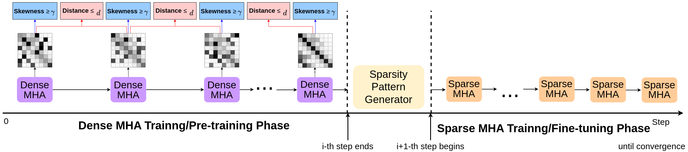
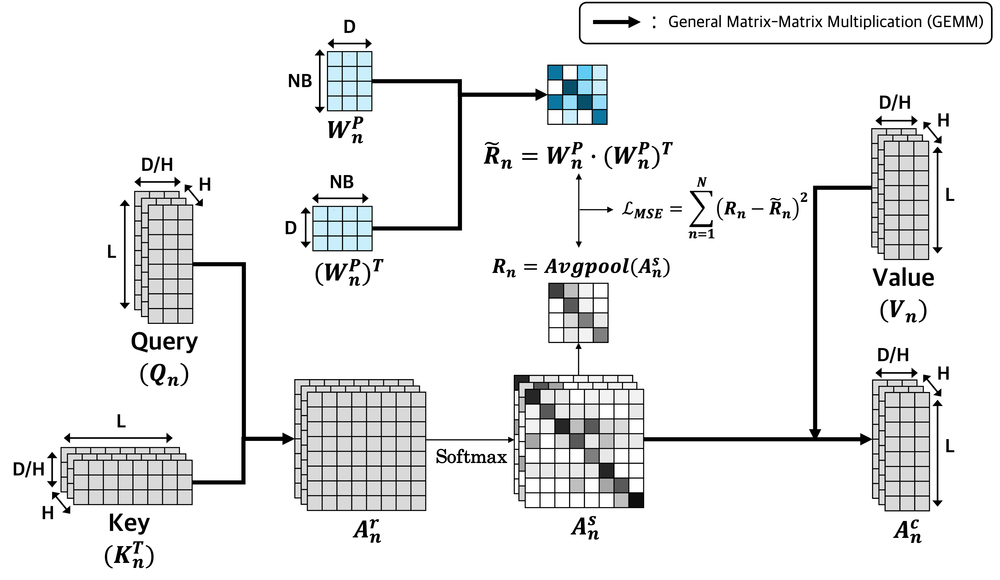
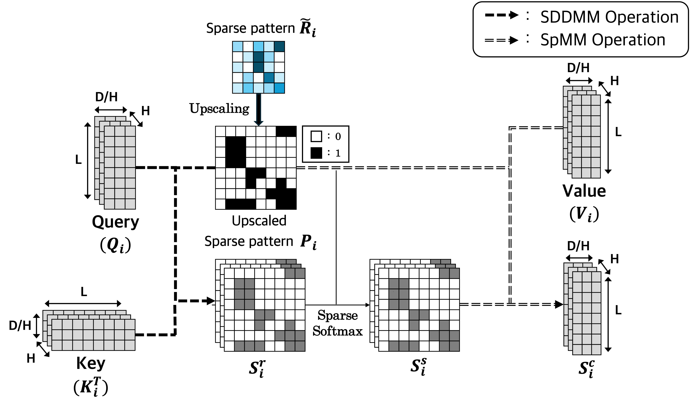

# SAT

This repository is for SAT model by [@Bokyeong1001](https://github.com/Bokyeong1001), proposed in the following paper:

> [Bokyeong Yoon](https://sites.google.com/view/bkyoon), Ah-Hyun Lee and [Gordon Moon](https://gordonmoon.github.io/). SAT: Exploring Attention Sparsity to Accelerate Transformer Training on GPUs. [Paper in IEEE Access](https://ieeexplore.ieee.org/document/10589623). 

## Introduction

The computational complexity required for training a Transformer model quadratically increases as the length of the input sequence increases.
Therefore, to accelerate the training of a large-scale Transformer with long sequences, it is crucial to reduce the number of operations for the multi-head attention computations, which dominate the overall Transformer training process.
Previous approaches have sought to sparsify the multi-head attention before training by statically selecting the critical elements in the attention score matrix.
However, since the critical elements in the attention score matrix can vary across different model tasks and datasets, dynamically considering the critical elements is essential for achieving better model quality.
In this paper, we propose a new sparsity-aware Transformer that captures task- and input-dependent sparsity pattern in the attention score matrix during a small number of steps of the standard training of the Transformer.
Then the identified sparsity pattern is utilized in the sparse training, transferred from the standard training, based on the degree of skewness and distance values of the attention score matrices.
Experimental results demonstrate that our approach significantly reduces the number of operations in the multi-head attention operations, achieving up to 2.84$\times$ training speedup, 6.87$\times$ memory reduction and better accuracy compared to state-of-the-art sparse Transformer models.




## Requirements
* python 3.8+
* Pytorch 1.13.1+cu117+
* CUDA 11.7.1+
* numpy 1.24.3+

## Data Preparation 

Prepare data referring to [here](https://github.com/pkuzengqi/Skyformer)

## Usage

### 1. Compile CUDA Modules for Attention and Sparse Attention Operations

```
sh compile.sh
```

### 2. Train
```
python main_learnable_skewness.py --mode train --task lra-image --random 1001 --name sat --sk 1.7 --ds 1.3
```


### 3. Inference

```
python main_inference.py --mode eval --task lra-image --random 1001 --name sat
```


## Citation
```
@article{yoon2024exploring,
  title={Exploring Attention Sparsity to Accelerate Transformer Training on GPUs},
  author={Yoon, Bokyeong and Lee, Ah-Hyun and Kim, Jinsung and Moon, Gordon Euhyun},
  journal={IEEE Access},
  year={2024},
  publisher={IEEE}
}
```
